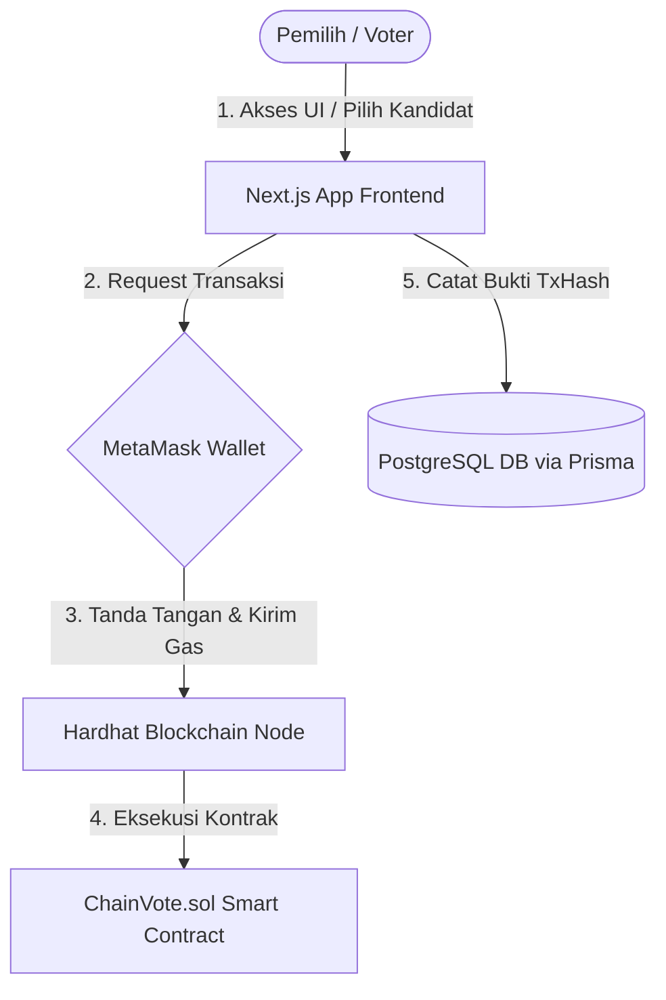

# 🎓 Panduan Komprehensif: Presentasi, Demo & Kunci Jawaban Dosen (ChainVote)
> **Sistem E-Voting Berbasis Blockchain Ethereum (Hardhat) & Next.js**

Dokumen ini disusun khusus sebagai **panduan taktis terpadu** yang menggabungkan seluruh penjelasan detail kriptografi (hashing vs enkripsi), langkah konkret demonstrasi blockchain secara fisik, bukti transaksi blockchain, strategi presentasi kelompok, serta prosedur pembersihan data secara total (*clear slate*).

---

## 📂 DAFTAR ISI:
1.  **BAB 1:** Panduan Komprehensif Menjawab Pertanyaan Dosen (QA Umum & Keamanan)
2.  **BAB 2:** Penjelasan Detail Hashing vs Enkripsi (Kriptografi, Keccak-256, ECDSA, & bcrypt)
3.  **BAB 3:** Panduan Cara Mendemonstrasikan Blockchain secara Fisik
4.  **BAB 4:** Bukti Fisik atau Aktivitas Blockchain (TxHash, Blocks, & Database Receipts)
5.  **BAB 5:** Panduan Alur Kerja Presentasi & Strategi Demo Kelompok
6.  **BAB 6:** 🧹 Prosedur Pembersihan Total Database & Blockchain (*100% Fresh & Clean Slate*)

---

## 🏛️ BAB 1: PANDUAN KOMPREHENSIF MENJAWAB PERTANYAAN DOSEN (QA UMUM)

Berikut adalah daftar pertanyaan akademik kritis yang paling sering diajukan oleh dosen penguji beserta strategi jawaban ilmiahnya:

### ❓ Pertanyaan 1: "Mengapa harus menggunakan Blockchain? Mengapa tidak pakai Database SQL biasa?"
*   **💡 Kunci Jawaban:**
    *"Jika menggunakan database tradisional (seperti PostgreSQL/MySQL), data disimpan secara terpusat (centralized). Admin database memiliki akses superuser yang secara teoritis dapat mengubah angka perolehan suara di tabel database secara langsung tanpa ketahuan (tidak ada jejak audit yang valid)."*
    
    *"Dengan **Blockchain (Smart Contract)**, data perolehan suara memiliki sifat **Immutable** (tidak dapat diubah atau dihapus setelah ditulis) dan **Decentralized**. Setiap suara dikirim sebagai transaksi yang ditandatangani secara kriptografis oleh dompet digital (MetaMask) pemilih. Sekalipun database Next.js diretas, perolehan suara asli di dalam blockchain tetap murni dan tidak dapat dirusak karena dilindungi oleh konsensus jaringan."*

### ❓ Pertanyaan 2: "Bagaimana cara Smart Contract mencegah pemilih memberikan suara dua kali (Double Voting)?"
*   **💡 Kunci Jawaban:**
    *"Pencegahan double-voting divalidasi langsung di tingkat EVM (Ethereum Virtual Machine) melalui kode smart contract Solidity, bukan hanya sekadar filter di frontend Next.js."*
    *   Tunjukkan alur logika di file `ChainVote.sol`:
        1. Smart contract menggunakan struktur pemetaan:
           ```solidity
           mapping(address => bool) public hasVoted;
           ```
        2. Pada fungsi `vote()`, terdapat baris keamanan mutlak:
           ```solidity
           if (hasVoted[msg.sender]) revert AlreadyVoted();
           ```
        3. Begitu transaksi pertama berhasil diproses, address wallet pengirim diset menjadi `true`:
           ```solidity
           hasVoted[msg.sender] = true;
           ```
    *"Jika dompet yang sama mencoba mengirimkan transaksi voting kedua kalinya, EVM akan langsung menggagalkan transaksi tersebut secara otomatis (**revert**) dan mengembalikan Gas Fee yang tersisa. Ini menjamin aturan **Satu Wallet = Satu Suara** secara absolut."*

### ❓ Pertanyaan 3: "Bagaimana dengan Anonimitas Pemilih? Bukankah transaksi di Blockchain transparan dan bisa dilacak?"
*   **💡 Kunci Jawaban:**
    *"Di dalam sistem ChainVote, kami menerapkan prinsip **Pseudonymous** (Anonimitas Semu). Di dalam Smart Contract, **kami tidak pernah menyimpan nama asli, NIK, atau email pemilih**."*
    
    *"Smart contract hanya mencatat bahwa **Wallet Address 0xABC...** telah memberikan suara untuk **Kandidat Nomor X**. Secara publik, siapa pun dapat melihat transaksi tersebut di jaringan blockchain, tetapi tidak ada yang tahu siapa pemilik asli di balik address `0xABC...` tersebut kecuali instansi penyelenggara pemilu yang memegang data registrasi offline."*

### ❓ Pertanyaan 4: "Bagaimana cara membatasi agar orang tidak bisa memilih sebelum pemilu dimulai atau setelah pemilu berakhir?"
*   **💡 Kunci Jawaban:**
    *"Kami menetapkan parameter waktu unix timestamp (`startTime` dan `endTime`) saat mendeploy smart contract. Keamanan waktu divalidasi langsung secara on-chain menggunakan waktu blok (`block.timestamp`):"*
    ```solidity
    if (block.timestamp < startTime) revert VotingNotStarted();
    if (block.timestamp > endTime) revert VotingEnded();
    ```
    *"Artinya, sekalipun ada pihak yang mencoba menembak fungsi transaksi secara manual ke smart contract di luar jam pemilu, blockchain akan menolak transaksi tersebut karena stempel waktu blok tidak memenuhi syarat."*

---

## 🔐 BAB 2: PENJELASAN DETAIL HASHING VS ENKRIPSI

> [!IMPORTANT]
> **Poin Akademis Penting:** Bedakan dengan tegas antara **Hashing** (satu arah, tidak bisa didekripsi) dan **Enkripsi** (dua arah, bisa didekripsi). Lecturers sangat sensitif dengan perbedaan istilah ini!

| Fitur | Hashing | Enkripsi |
| :--- | :--- | :--- |
| **Sifat** | Satu arah (One-way) | Dua arah (Two-way) |
| **Tujuan** | Menjamin integritas data & verifikasi cepat | Menjaga kerahasiaan isi pesan (Confidentiality) |
| **Dapat Didekripsi?**| **Tidak bisa**. Tidak ada kunci untuk mengembalikannya.| **Bisa**. Menggunakan kunci dekripsi (*Private Key*).|

### 💡 Jawaban Taktis untuk Dosen:
*"Sistem ChainVote kami menggunakan beberapa algoritma Kriptografi, Hashing, dan Tanda Tangan Digital standar industri Web3 secara proporsional:"*

1.  **Hashing Transaksi Blockchain (`Keccak-256`):**
    *   **Kegunaan:** Jaringan Ethereum (Hardhat) menggunakan algoritma **Keccak-256** (keluarga SHA-3) untuk menghasilkan **Transaction Hash (TxHash)** unik bagi setiap suara masuk dan deployment kontrak pintar.
    *   **Sifat:** Hashing ini bersifat satu arah untuk memastikan bahwa transaksi tidak dapat dipalsukan atau dimodifikasi tanpa merusak integritas hash tersebut.
2.  **Kriptografi Asimetris & Tanda Tangan Digital (`ECDSA`):**
    *   **Kegunaan:** MetaMask menggunakan algoritma **ECDSA (Elliptic Curve Digital Signature Algorithm)** dengan kurva elips **`secp256k1`** (standar global Ethereum).
    *   **Cara Kerja:** Algoritma ini digunakan pemilih untuk menandatangani secara digital transaksi voting menggunakan *Private Key* dompet mereka, yang kemudian divalidasi oleh smart contract di EVM menggunakan *Public Key* (alamat wallet) pemilih.
    > *Catatan:* Pilihan suara pemilih sendiri (misalnya memilih Kandidat No. 2) **tidak di-enkripsi** menjadi teks rahasia, melainkan tercatat transparan di ledger namun identitas asli pemilik alamat dompet tersebut yang tetap anonim/pseudonim.
3.  **Hashing Password Akun Web2 (`bcrypt`):**
    *   **Kegunaan:** Untuk keamanan database tradisional PostgreSQL, sistem Next.js kami menggunakan algoritma **`bcrypt`** untuk melakukan *hashing* pada kata sandi pengguna sebelum disimpan ke database, guna mencegah kebocoran data jika database diretas.

---

## 🖥️ BAB 3: PANDUAN CARA MENDEMONSTRASIKAN BLOCKCHAIN SECARA FISIK

Jika dosen Anda bertanya: *"Mana buktinya sistem ini benar-benar terhubung ke blockchain dan bukan sekadar database pura-pura?"*, ikuti panduan demonstrasi fisik di bawah ini:

### 1. Demonstrasi Log Node Blockchain Real-Time (Terminal)
*   **Langkah Aksi:**
    1.  Tampilkan layar terminal/command prompt di laptop Anda yang sedang menjalankan proses `pnpm blockchain:node`.
    2.  Saat Anda menekan tombol **"Deploy ke Blockchain"** di web admin, biarkan dosen melihat terminal tersebut mencetak log deployment contract baru secara instan.
    3.  Saat pemilih menekan **"Cast Vote"** di browser, tunjukkan log terminal yang mencetak informasi transaksi secara real-time.
*   **Informasi yang Dicetak Terminal:**
    *   Nama Kontrak Pintar: `ChainVote`
    *   Alamat Kontrak Pintar: `0x5FbDB2315678afecb367f032d93F642f64180aa3` (menandakan contract berhasil masuk ke blok genesis).
    *   Fungsi yang dipanggil: `vote()`
    *   Biaya komputasi transaksi: `Gas Used`

### 2. Demonstrasi Tanda Tangan Transaksi Dompet (MetaMask Activity)
*   **Langkah Aksi:**
    1.  Buka ekstensi **MetaMask** di pojok kanan atas browser Google Chrome / Brave Anda.
    2.  Masuk ke tab **"Activity"** (Aktivitas).
    3.  Tunjukkan daftar riwayat transaksi bertuliskan *"Contract Interaction"* atau *"Contract Deployment"*.
    4.  Klik pada salah satu transaksi tersebut untuk menampilkan detail rincian Gas Fee, stempel waktu, dan transaction hash asli yang ditandatangani oleh pemilih.

---

## 🛡️ BAB 4: BUKTI FISIK ATAU AKTIVITAS BLOCKCHAIN (RECEIPTS)

Di dalam sistem ChainVote, setiap aksi Web3 memiliki **bukti fisik (digital receipt)** yang dapat diaudit secara publik di database maupun antarmuka (UI):

1.  **Transaction Hash (TxHash):**
    *   Setiap kali suara dicatat, blockchain menghasilkan string unik 64-karakter (misal: `0x7dca09c...`). Ini adalah **bukti digital tanda terima** suara Anda yang sah.
2.  **Block Number (Nomor Blok):**
    *   Menunjukkan nomor blok spesifik di Ethereum tempat suara Anda ditambang (*mined*) secara permanen.
3.  **Database Audit Trail (Prisma/PostgreSQL):**
    *   Kami menyimpan metadata receipt transaksi di tabel database `VoteRecord` dan `ContractLog` (memuat `txHash` dan `blockNumber`).
    *   *Penjelasan ke dosen:* *"Kami menyimpan TxHash di database relasional untuk kecepatan pencarian data (index pencarian) dan sebagai audit trail silang. Jika ada kecurigaan data database diubah, siapa saja dapat melakukan audit silang dengan membandingkan TxHash tersebut ke node blockchain murni."*

---

## 📈 BAB 5: PANDUAN ALUR KERSA PRESENTASI & STRATEGI DEMO KELOMPOK

### 1. Diagram Arsitektur Interaksi Sistem
Untuk slide presentasi, gunakan diagram alur di bawah ini untuk memukau dosen:



---

## 🧹 BAB 6: PROSEDUR PEMBERSIHAN TOTAL DATABASE & BLOCKCHAIN (100% FRESH SLATE)

Sebelum presentasi di hadapan dosen dimulai, Anda wajib membersihkan seluruh riwayat uji coba pemilu (test votes, candidates, dan contract usang) agar aplikasi benar-benar **bersih dari nol (100% fresh)**. Ikuti prosedur 3-Langkah berikut:

### Langkah 1: Bersihkan PostgreSQL Database
Jalankan perintah berikut di terminal proyek Anda:
```bash
pnpm prisma:seed
```
*   **Apa yang Terjadi?** 
    Sistem akan menghapus seluruh data Sesi Voting, data Kandidat, riwayat Suara Masuk (`VoteRecord`), serta `ContractLogs` hingga benar-benar **kosong (0 data)**.
*   **Kenapa tidak dikosongkan total 100% tanpa user?**
    Next.js memerlukan setidaknya **1 akun Admin** terdaftar agar Anda bisa login dan menunjukkan cara membuat pemilu. Perintah di atas menghapus semua pemilu, tapi secara cerdas menyisakan **1 akun Admin** dan **3 akun Voter aktif** siap pakai agar Anda tidak perlu repot-repot mendaftar dan memverifikasi akun di depan dosen.

### Langkah 2: Bersihkan Blockchain Lokal (Hardhat Network)
Logika blockchain murni menyimpan riwayat kontrak pintar selamanya. Untuk menghapusnya total kembali ke awal:
1.  Buka terminal tempat Anda menjalankan node lokal **`pnpm blockchain:node`**.
2.  Matikan proses tersebut dengan menekan tombol **`Ctrl + C`** di keyboard Anda, lalu ketik `Y` untuk konfirmasi.
3.  Jalankan kembali node blockchain bersih murni dengan mengetik:
    ```bash
    pnpm blockchain:node
    ```
*   **Apa yang Terjadi?**
    Seluruh smart contract lama terhapus total. Node blockchain lokal Anda kembali bersih dari **Blok Genesis #0**, dan semua saldo wallet simulasi MetaMask Anda terisi penuh kembali menjadi **10,000 ETH**.

### Langkah 3: Bersihkan Riwayat Transaksi Dompet (MetaMask Reset)
Karena blockchain lokal baru saja di-restart kembali ke Block #0, MetaMask di browser Google Chrome Anda mungkin akan mendeteksi desinkronisasi jumlah transaksi (*nonce*). Anda **wajib** melakukan reset akun di MetaMask agar tidak error saat demo:
1.  Buka ekstensi **MetaMask** di Google Chrome Anda.
2.  Klik tombol **Titik Tiga** di pojok kanan atas MetaMask, lalu pilih **Settings (Pengaturan)**.
3.  Pilih menu **Advanced (Tingkat Lanjut)**.
4.  Gulir ke bawah dan klik tombol **"Clear activity tab data"** (atau **"Reset Account"** pada versi MetaMask lama).
5.  Konfirmasi pembersihan. Riwayat transaksi lama di dompet browser Anda akan dibersihkan dan siap mendeteksi blockchain bersih Anda!
