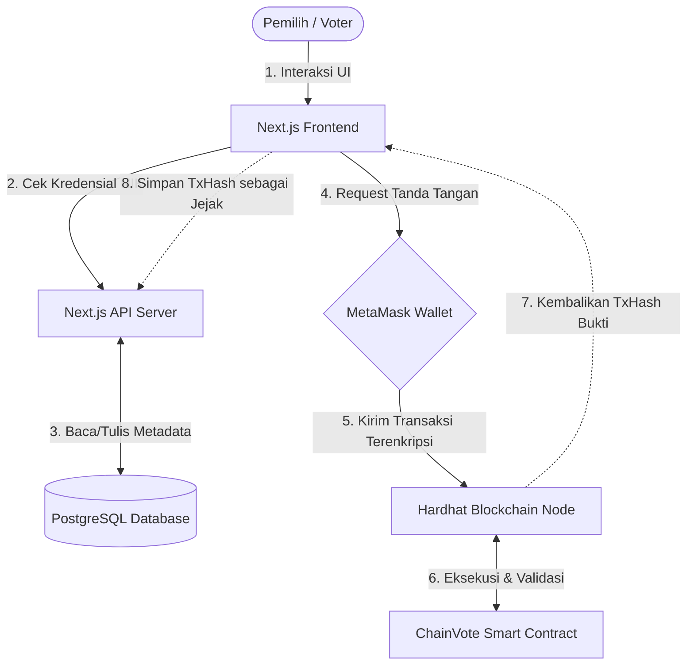

# 🌐 Topologi & Arsitektur Keamanan ChainVote

Dokumen ini menjelaskan struktur jaringan (topologi) dan lapisan keamanan komprehensif yang diterapkan dalam sistem **ChainVote** (E-Voting Berbasis Hybrid Web2 + Web3).

---

## 🏗️ 1. Topologi Sistem (Arsitektur Hybrid)

Sistem ChainVote tidak berdiri di satu server tunggal, melainkan menggunakan topologi **Hybrid Decentralized Architecture**. Sistem ini membagi beban kerja ke dalam 5 node/lapisan utama:

### A. Lapisan Klien (Frontend / Next.js)
- **Fungsi:** Antarmuka pengguna (UI) tempat pemilih login, melihat daftar kandidat, dan memilih.
- **Teknologi:** Next.js (React), Tailwind CSS, ethers.js / viem (untuk komunikasi Web3).
- **Interaksi:** Berkomunikasi dengan Backend API (Web2) dan Ekstensi MetaMask (Web3) secara simultan.

### B. Lapisan Jembatan Kriptografi (MetaMask)
- **Fungsi:** Bertindak sebagai *middleware* dompet digital yang menyimpan *Private Key* pengguna.
- **Peran:** Menandatangani transaksi (*Digital Signature*) dari Klien sebelum dikirimkan ke jaringan Blockchain.

### C. Lapisan Server Terpusat (Backend Next.js API / Prisma)
- **Fungsi:** Mengelola autentikasi tradisional (Login NIK), menyajikan data *read-only* (daftar kandidat, riwayat pemilu) dengan cepat, dan menyimpan *metadata* transaksi.
- **Kenapa dibutuhkan?** Agar aplikasi tetap cepat (Web2 speed) dan tidak semua data publik/berat (seperti foto kandidat) harus disimpan di blockchain yang berbiaya mahal.

### D. Lapisan Database Relasional (PostgreSQL)
- **Fungsi:** Menyimpan entitas Web2 seperti tabel `User`, `Candidate`, `VotingSession`, dan `VoteRecord`.
- **Peran Audit:** Menyimpan jejak *TxHash* dari blockchain untuk tujuan sinkronisasi dan pencarian data yang cepat (*indexing*).

### E. Lapisan Blockchain (Hardhat Node / EVM)
- **Fungsi:** Inti (Core) dari sistem perhitungan suara yang terdesentralisasi.
- **Teknologi:** Hardhat Local Network (Ethereum Virtual Machine).
- **Komponen Utama:** *Smart Contract* `ChainVote.sol` yang memegang wewenang mutlak untuk menolak atau menerima suara, memastikan tidak ada manipulasi.

---

---

## 🛡️ 2. Lapisan Keamanan (Security Layers)

Keamanan ChainVote dirancang berlapis (*Defense in Depth*), mulai dari level database hingga jaringan blockchain.

### 1. Autentikasi Lapis Ganda (Dual-Layer Auth)
- **Web2 Security:** Pengguna harus melewati login tradisional. *Password* dan NIK dienkripsi menggunakan algoritma *hashing* **bcrypt** sebelum masuk ke database PostgreSQL.
- **Web3 Security:** Login web biasa tidak cukup untuk memanipulasi suara. Untuk *Vote*, pengguna **wajib** menandatangani transaksi menggunakan *Private Key* dompet MetaMask mereka (Algoritma **ECDSA secp256k1**).

### 2. Pencegahan *Double Voting* Tingkat Mesin (EVM Revert)
- Pencegahan pemilih ganda tidak dilakukan di *frontend* atau API *backend* yang rentan dijebol. 
- Validasi dilakukan langsung oleh *Smart Contract* di Blockchain. Variabel `mapping(address => bool) public hasVoted` memastikan satu alamat dompet = satu suara mutlak. Jika ditembus, jaringan EVM akan langsung menggagalkan transaksi (*revert*) dengan error `AlreadyVoted()`.

### 3. *Data Immutability* (Anti-Manipulasi)
- Begitu suara (*vote*) berhasil diproses dan masuk ke dalam sebuah Blok (Block) di jaringan Hardhat/Ethereum, data tersebut menjadi **Immutable** (Abadi/Tidak dapat diubah).
- Bahkan jika *Admin* aplikasi diretas atau memiliki niat buruk, mereka **tidak bisa** mengubah total suara di blockchain karena mereka tidak memegang *Private Key* milik para pemilih dan tidak bisa memalsukan transaksi masa lalu.

### 4. Validasi Waktu Ketat (*Time-Locked Contract*)
- Kapan pemilu dimulai dan ditutup diatur menggunakan stempel waktu kriptografis dari *Node* Blockchain (`block.timestamp`).
- Apabila ada *hacker* mencoba mengirim transaksi secara paksa di luar jam yang diizinkan (misal via skrip eksternal), *Smart Contract* akan menolaknya dengan *Custom Errors* `VotingNotStarted()` atau `VotingEnded()`.

### 5. Jejak Audit Silang (*Cross-Audit Trail*)
- Setiap suara yang sah menghasilkan tanda terima berupa **Transaction Hash (TxHash)**.
- TxHash ini disimpan di database PostgreSQL. Ini menciptakan transparansi penuh: Jika ada pihak mencurigai angka di UI Web diubah-ubah, pengawas (auditor) dapat mengambil TxHash dari Web, lalu mengeceknya langsung ke Node Blockchain murni (Hardhat) untuk melihat apakah transaksinya sah dan belum pernah diotak-atik.

### 6. Perlindungan Privasi Pemilih (*Pseudonymous Voting*)
- Asas kerahasiaan (*Privacy*) dijamin karena **Data Pribadi (NIK, Nama)** sama sekali tidak dikirim atau disimpan di Blockchain.
- Blockchain hanya mencatat bahwa sebuah "Alamat Dompet Rahasia" (misal: `0x7aB3...`) memberikan 1 suara. Ini mencegah pelacakan profil politik seseorang jika data blockchain dibaca oleh publik.
